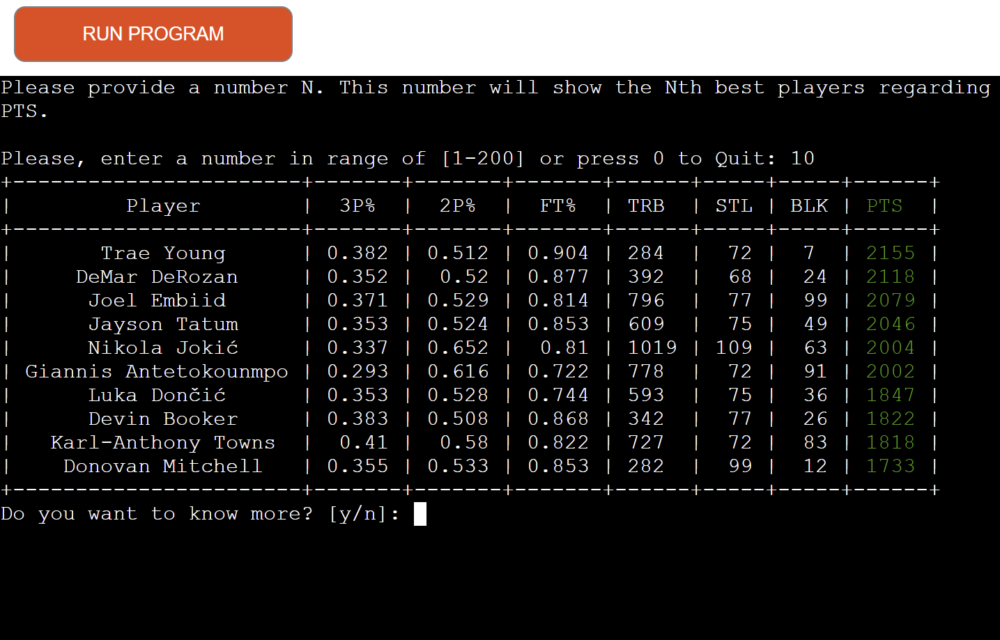

# **NBA stats 2021-22** 

## **FEATURES**
- ### **DESCRIPTION**
  This is a program that uses statistical data about all the active NBA players from season 2021-2022, filters them out and the user can choose to show a number of players sorted (1-200) by stats like, points, steals, blocks, rebounds, 2PT%, 3PT%, FT%. Additional the user can see and the position of the player beside the name.
  Also the user have the choice to quit the program.

- ### **TECHNOLOGIES**
  - [Git](https://git-scm.com/) for version control.
  - [Gitpod](https://www.gitpod.io/) online IDE.
  - [GitHub](https://github.com/) for host repository.

  ### **Languages Used**
  This tool is created using [Python](https://en.wikipedia.org/wiki/Python_programming_language)
 language.

  ### **Libraries Used**
  - Git: For version control These commands were used for version control during project:
  - git add . or git add -A: To add files before committing
  - git commit -m: "type your message mentioning changes" - To commit changes to the local repository
  - git push : To push all committed changes to the GitHub repository
  - GitHub : To create my repositories, save and store my project files.
  - gspread:  is a Python API for Google Sheets and requires Python 3+. It allows user to open, read, write, share spreadsheets. Additionally it enables user to select, create, delete worksheets and to format cell ranges.
  - google auth.: This library provides the ability to authenticate to Google APIs using various methods. It also provides integration with several HTTP libraries.
  - pprint : Data pretty printer — Python 2.7, 3.5 onwards. The pprint module provides “pretty-print” to Python data structures. The formatted representation arranges objects on a single line if it can, and breaks them onto multiple lines if they don’t fit within the allowed width. I used it in order to visualize the lists in more user friendly style.
  - numPy provides:
    -  An array object of arbitrary homogeneous items
    - Fast mathematical operations over arrays
    - Linear Algebra, Fourier Transforms, Random Number Generation 
    - OS : for the clear terminal function.
     
 - ### **DATA**
   I used the data for my program from [NBA_2021-22_totals](https://www.basketball-reference.com/leagues/NBA_2022_totals.html)
   Also you can take a look to the screenshot below.
   

 - ### **FILES**
   I used two files for my code because it was too long:
   - run.py
   - user_input.py (This file has all the code for the user)

 - ### **FLOW CHART**
   The flow chart was created using https://app.diagrams.net, a web-based diagramming application. The flow charts shown below, shows the design concept the application. 
   It shows what is the flow of the application depending user input.

  

 - ## **STEPS**

   - ## **Step 1**
   At the step1 the user has a welcome message and a nice comment.
   Also a username required. The user can put a valid name to continue. If not the user can see a comment Invalid data. Please put a valid name.
   
   

   - ## **Step 2**
   At the second step the user can see another nice comment for the username. Below from that the user can see the option that has.
   The option are 1-7 (points, steals, blocks, rebounds, 2PT%, 3PT%, FT%) also it has an option with number 0 to Quit.
   

   - ## **Step 3**
   At this step the user has already choose what option wants to check.
   Also at the same step the user has an option which NBA players prefer to see the stats TOP (best players) or the BOTTOM (least best players) with the option 1 and 2.
   

   - ## **Step 4**
   At step 4 the user can provide with a number N. this number will shown you the Nth the best players (or the least best players) regarding the option that has already selected at the previous step.
   So, the user at this step can choose how many NBA players wants to check between 1-200.
   

   - ## **Step 5**
   At this step the user finally can see the results that asked. 
   Also the column with the stats that asked to check it will be green so can see immediately the option wanted.
   

   
   - ## **Step 6**
   At the finally step the user has another option with a comment  as "DO you want to know more?" y/n.
   If no the user receiving a nice comment to stop as "Thank you for using our programme! Bye!!".
   

   

 - ### **TESTING**
    - Python Linter Test
 As advised by tutors, I validated Code Institute Python linter.
 No errors were found when passing through the official (Python Linter Test) validator
  
 - ### **UNFIXIDED BUGS**
    - No bugs
 - ### **DEPLOYMENT**
    - On the Heroku dashboard, select "New" and click "Create new app"
    - Create a unique app name
    - Select your region
    - Click "Create app"
    - Go to the settings tab:
    - Scroll down to the config vars section and select "Reveal Config Vars"
    - Add necessary config vars
    - In this case, in the key field enter "PORT" and the value field enter "8000"
    - Click "Add"
    - Scroll down to Buildpacks and click "Add buildpack"
    - Add the necessary buildpacks.
    - In this case, select "python" and click "Save changes"
    - Then, select "node.js" and click "Save changes"
    - Go to the Deploy tab:
    - Select GitHub and confirm connection to GitHub account
    - Search for the repository and click "Connect"
    - Scroll down to the deploy options
    - Select automatic deploys if you would like automatic deployment with each new push to the GitHub    repository
    - In manual deploy, select which branch to deploy and click "Deploy Branch"
    - Heroku will start building the app
    - The link to the app can be found at the top of the page by clicking "Open app"
    - The link can be found here

 - ### **CREDITS**
     - [stackoverflow](https://stackoverflow.com/)
     - [w3schools](https://www.w3schools.com/)
     - geeksforgeeks
     - [colorama](https://pypi.org/project/colorama/)
     - [diagram](https://app.diagrams.net/)

 - ### **ACKNOWLEDGEMENTS**
     I'd like to thank my mentor, Akshat Garg, for providing advices and feedback for this project. Also the tutors and the students for the comments to Slack.